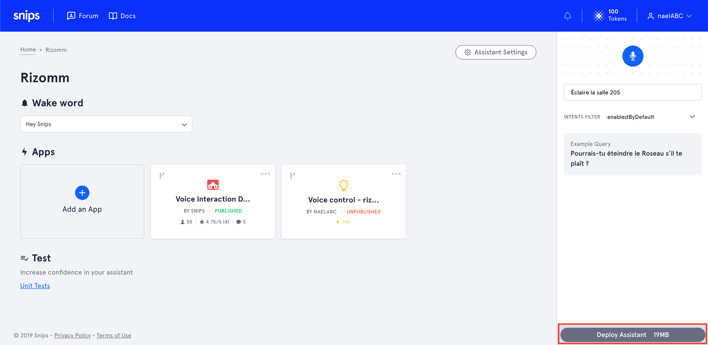

# Snips pour Rizomm

Snips nous permet de créer un assistant vocal privé.
## Pré-requis
* Maker kit Snips
* Node ( >= 7.5.0)
* Git

## Installation du maker kit
### 1. Installation raspbian sur la carte SD

Procurez-vous une image Raspbian stretch Lite sur le [site officiel](https://www.raspberrypi.org/downloads/raspbian/) et flashez la sur la carte SD qui va servir de disque dur au raspberry. (utiliser BalenaEtcher, par exemple)

### 2. Configurer la connexion internet du raspberry
1. Connexion wifi
> Si votre raspberry est connecté en ethernet, vous pouvez passer cet étape

Avant de mettre la carte SD dans votre appareil, mettez dedans un fichier nommé ```wpa_supplicant.conf```  contenant ce snippet de code :
```
country=<COUNTRY_CODE>
ctrl_interface=DIR=/var/run/wpa_supplicant GROUP=netdev
update_config=1
network={
	ssid="Your Wi-Fi network name"
	psk="Your Wi-Fi network password"
}
```
Assurez-vous de remplacer les valeurs de **country** (FR pour la France), **ssid** et **psk**.

2. Accès SSH

Afin d'activer l'accès ssh au raspberry, veuillez créer un fichier nommé ```ssh``` et mettez le dans la carte SD.

## Installation de la plateforme Snips

Afin de pouvoir communiquer facilement avec votre raspberry et pouvoir y installer la plateforme Snips il vous faut installer la [CLI Sam](https://docs.snips.ai/reference/sam)

```sudo  npm  install -g snips-sam```

Une fois installé, vous pouvez retrouver votre raspberry (s'il est bien connecté sur le même réseau que votre ordinateur) en tapant :

```sam devices```

Si tout va bien vous devriez avoir un retour tel que le suivant : 

```
Scanning Raspberry Pi devices on the network...
Found 1 device:
- raspberrypi (192.168.9.2)
```

Connectez-vous à votre raspberry en tapant :

``` sam connect raspberrypi ```

et enfin, initialisez la plateforme :

```sam init ```

Après quelques minutes vous serez prêt à configurer la partie audio du raspberry.

## Configuration du matériel audio

**sam** nous offre une solution assez simple de configurer le microphone ainsi que le speaker du maker kit.

Vous n'avez qu'à taper la commande suivante : 

```sam setup audio```

puis suivez les étapes d'installation de vos périphériques.

Enfin, testez-les avec les commandes suivantes : 

```sam test speaker```
et
```sam test microphone```

## Création de l'assistant

Pour la création de l'assistant il va falloir vous rendre sur la [console snips](https://console.snips.ai) afin d'y ajouter des apps ou d'en créer.

L'idée ici est de créer une app, afin de convenir aux besoins du batiment.
Vous pouvez suivre ce [tutoriel](https://docs.snips.ai/articles/console/actions/first-steps) afin de prendre en main la console et la création des éléments nécessaires à l'assistant.

Pour notre exemple nous avons créé deux intents, un qui sera relevé lorsque nous demandons d'éteindre la lumière et l'autre, de l'allumer. 
Dans ces intents nous avons créé que un slot qui permet de définir l'endroit où nous voulons contrôler l'éclairage.

Vous pouvez faire de même. 

### Déploiement sur le raspberry

Une fois l'app créée il vous faut la tester, vous pouvez donc déployer l'assistant sur le raspberry en cliquant sur le bouton **deploy assistant**



Vous récupérez ensuite la ligne de commande et la tapez dans un terminal.

Le déploiement et l'installation vont s'effectuer automatiquement. 


### Que faire de ça ? 

Vous pouvez clone ce projet puis vous rendre dans son répertoire et

